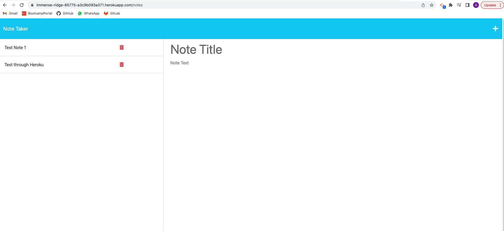

# Note Taker App

## Description

The task was to is to modify the provided front-end starter code with the back-end code to create an application called Note Taker that can be used to write and save notes. This application uses an Express.js back end and saves and retrieves note data from a JSON file. As part of the bonus challenge, I have also incorporated the logic to delete the notes after they are created.

The application has been deployed to Heroku. The URL is: https://immense-ridge-85775-a3c9b093a371.herokuapp.com/

The Github Repository can be found here: https://github.com/annalisedev/notetaker 

## Screenshots

A screenshot of the homepage can be found in assets:

A screenshot of the notes page can be found in assets:

## Support

I extensively used the activities from week 11, where we covered Express.js to help me complete this challenge. Thanks to the course for the starter front-end code!

This link supported with the deployment to Heroku: https://coding-boot-camp.github.io/full-stack/heroku/heroku-deployment-guide